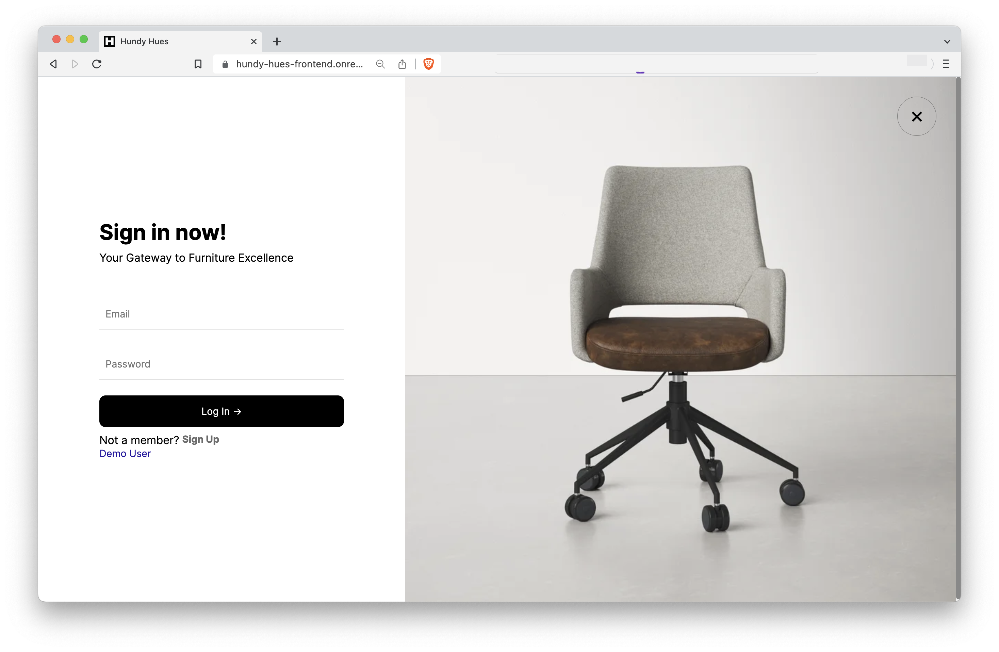
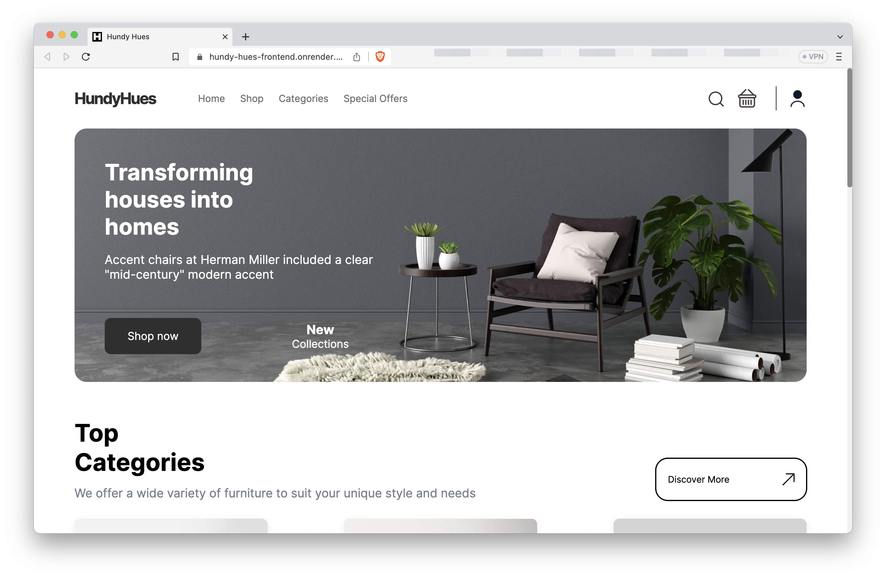
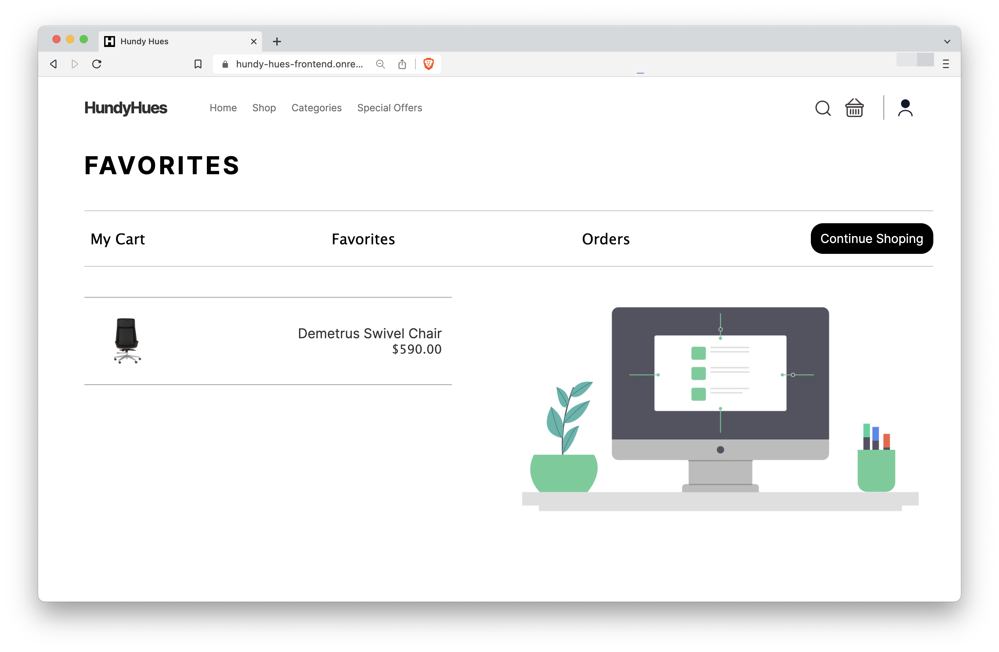

# Hundy Hues - Furniture Design Company

Hundy Hues is an innovative ecommerce platform that offers a curated collection of stylish furniture and home decor products. Transforming houses into homes by providing unique and functional pieces that reflect your personal style. Hundy Hues brings you a user friendly shopping experience to help you create spaces that truly feel like your own.

**Link to project:** [https://hundy-hues-frontend.onrender.com/](https://hundy-hues-frontend.onrender.com)

## How It's Made:

**Tech stack:** React, PostgreSQL, Express, NodeJS, Stripe, Framer Motion, Lottie

My main objective was to deliver a webpage that features a user-friendly UI and intuitive design, making browsing and purchasing effortless. Embracing a minimalist and responsive approach.

## Optimizations

I would like to improve:

- Users being able to share products they like.
- Create an admin login
- The ability to change password if user desires from profile page

## Dependencies

### Client:

- stripe
- axios
- framer-motion
- lottie-react

### Server:

- bcrypt
- cors
- dotenv
- express
- jsonwebtoken
- morgan
- pg
- pg-pool

## Getting Started

Install dependencies using the npm install command within each frontend/backend folders.

- Start the backend web server using the npm start. The app will be served on http://localhost:5432/.

- Start the frontend using the npm start local command. Go to http://localhost:5143/ in your browser.
